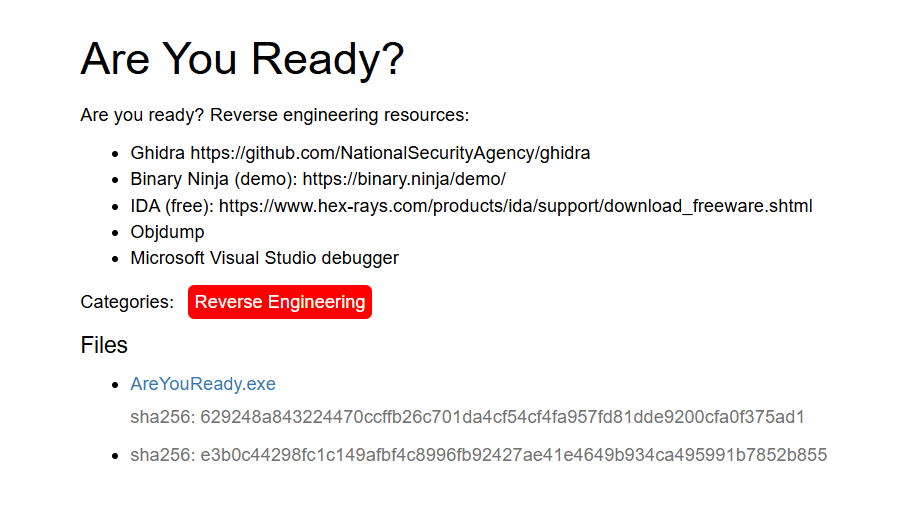

# Are You Ready? (CTF Challenge)



---

## Challenge Description
This was a reverse engineering challenge. The provided file was an executable named **AreYouReady.exe**.  
We were given several suggested tools to analyze it, including Ghidra, IDA, Binary Ninja, Objdump, and Visual Studio debugger.

**Files:**
- AreYouReady.exe  
  - sha256: 629248a843224470ccffb26c701da4cf54cf4fa957fd81dde9200cfa0f375ad1  
  - sha256: e3b0c44298fc1c149afb4c8996fb92427ae41e4649b934ca495991b7852b855  

---

## My Approach

### 1. Initial Analysis
At first, I overcomplicated things by thinking I needed to patch or modify the assembly. Instead, I imported the binary into both **Ghidra** and **IDA Freeware** to better understand its behavior.

In Ghidra, I found a function named `FUN_00401000`. IDA’s node view confirmed it was important. Inside this function, I noticed a suspicious string:

```
"flag{"
```

This immediately suggested the function contained the flag check.

---

### 2. Input Behavior
Running the executable showed it expected **command-line arguments**.  
Different inputs returned different error codes, so I knew the program’s logic depended on the argument provided.

---

### 3. Tracing the Condition
By following the conditionals in `FUN_00401000`, I found that the flag would only print if this check succeeded:

```c
iVar2 == 0x539
```

The value `0x539` in hexadecimal equals **1337** in decimal.

---

### 4. Getting the Flag
With that in mind, I ran the program with the correct argument:

```bash
AreYouReady.exe 1337
```

And the program printed the flag. ✅

---

## Lessons Learned
- Don’t overthink — sometimes the solution is a simple input validation.  
- Checking for strings like `flag{` in conditionals can quickly reveal where the success path is hidden.  
- Running binaries with different inputs is often the fastest way to confirm the execution path.  
