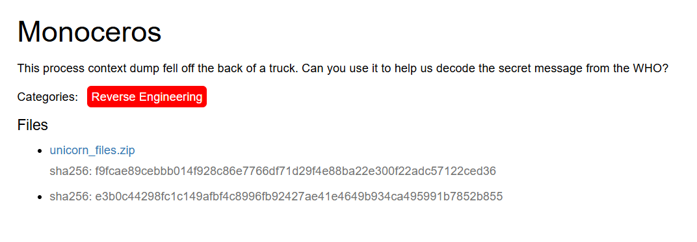

# Monoceros (Caesar Creek Software — Reverse Engineering)



---

## Challenge Description
> “This process context dump fell off the back of a truck. Can you use it to help us decode the secret message from the WHO?”

**Category:** Reverse Engineering  

**Files**
- `unicorn_files.zip`  
  - sha256: `f9fcae89ceb...57122ced36`  
- sha256: `e3b0c44298fc1c149afb4c8996fb92427ae41e4649b934ca495991b7852b855`

---

## My Process

### Step 1: First Attempts with Unicorn
This challenge reminded me of **CONFICKER-19**, where I had to decompile an ELF file, find the decoding logic, and then write my own decoder.  

I started by trying to run the **Unicorn emulator**, which seemed set up to emulate the captured memory `.bin` files in the `context` folder. I tried troubleshooting the harness and loader, but I couldn’t get the emulator to run correctly.

---

### Step 2: Inspecting the Context Metadata
I turned to the `context/index.json` file, which listed all the memory segments with their metadata (permissions, offsets, etc.).  

One segment stood out: **`unicorn/decoder`**, which was marked as executable (`"x": true`). Its backing file was:

```
e671702224d928a0cea4e69da55e40c9.bin
```

---

### Step 3: Decompressing the `.bin` Files
When I ran the `file` command on that `.bin`, it showed up as a **zlib-compressed file**.  

To explore it further, I wrote a quick **Python script** to decompress all the `.bin` files in the context folder. This gave me access to the raw decoder binary.

---

### Step 4: Reversing the Decoder
I opened the decompressed decoder binary in **Ghidra**.  

At first, I tried copying the decompiled functions into an IDE and fixing them up so I could run the decryption logic directly. But this didn’t work well — the code was messy and obfuscated, and I ran into a lot of issues trying to patch it.

---

### Step 5: Rewriting in Python
Instead of struggling with broken C, I decided to **re-implement the logic in Python**.  

To simplify things, I skipped the file input/output and just embedded the encrypted flag string directly into the script. I then translated the logic line by line, keeping variable names as close as possible to what Ghidra showed.  

I hit a few minor bugs along the way, but nothing major.  

---

### Step 6: Getting the Flag
After finishing the Python script, I ran it and successfully printed the decoded flag. ✅  

This whole challenge took me about **four days to solve**. It was frustrating at times, but I learned a lot about:
- Inspecting and decompressing memory dumps  
- Spotting the important executable segment in metadata  
- Translating obfuscated decompiled code into Python  

---

## Decompress helper (optional)

```python
# decompress_bins.py
import os, zlib, json

ctx = "context"
with open(os.path.join(ctx, "index.json"), "r") as f:
    meta = json.load(f)

out = "context_decompressed"
os.makedirs(out, exist_ok=True)

for seg in meta.get("segments", []):
    bin_path = os.path.join(ctx, seg["file"])
    name = seg.get("name") or os.path.basename(seg["file"]).split(".")[0]
    with open(bin_path, "rb") as bf:
        raw = bf.read()
    try:
        data = zlib.decompress(raw)
    except zlib.error:
        data = raw  # not compressed
    with open(os.path.join(out, f"{name}.bin"), "wb") as wf:
        wf.write(data)
    print("wrote", name)
```

---

## Final decoder (Python)

```python
# monoceros_decode.py
# Re-implementation of the decoded logic from the embedded decoder binary.

def FUN_001011f5(param_1: int) -> int:
    # Range check; returns left-shifted value on success.
    if param_1 < 0 or 0x10000 < param_1:
        return -0xFE
    return param_1 << 2

def FUN_00100d40(param_1: bytearray, param_2: int, param_3: bytearray, param_4: int) -> int:
    # Core unpacking routine (base-0x55 style) translated from decompiled C.
    local_18 = FUN_001011f5(param_2)
    if local_18 < 0:
        return local_18

    if param_4 < local_18:
        return -0xFF

    local_14 = 0
    local_18 = 0
    while local_14 < param_2:
        local_c = param_2 - local_14
        if param_1[local_14] == ord('z'):
            local_14 += 1
            local_10 = 0
            local_c = 5
        else:
            # Character range validation (printable subset used by the encoding).
            c = param_1[local_14]
            cVar1 = 1 if (c < 0x21 or 0x75 < c) else 0
            if any(cVar1 != 0 for _ in range(5 if local_c < 5 else local_c)):
                return -0xFD

            if local_c < 5:
                iVar5 = local_14 + 1
                lVar7 = local_14
                if iVar5 < param_2:
                    iVar4 = param_1[iVar5] - 0x21
                    local_14 += 2
                else:
                    iVar4 = 0x54
                    local_14 = iVar5

                if local_14 < param_2:
                    iVar5 = param_1[local_14] - 0x21
                    local_14 += 1
                else:
                    iVar5 = 0x54

                if local_14 < param_2:
                    iVar6 = param_1[local_14] - 0x21
                    local_14 += 1
                else:
                    iVar6 = 0x54

                uVar3 = ((((param_1[lVar7] - 0x21) * 0x55 + iVar4) * 0x55 + iVar5) * 0x55 + iVar6)
                if uVar3 > 0x3030303:
                    return -0xFC

                if local_14 < param_2:
                    bVar2 = param_1[local_14] - 0x21
                    local_14 += 1
                else:
                    bVar2 = 0x54

                uVar3 = uVar3 * 0x55
                if bVar2 > uVar3:
                    return -0xFC

                local_10 = uVar3 + bVar2
            else:
                iVar5 = local_14 + 4
                uVar3 = ((((param_1[local_14] - 0x21) * 0x55 +
                           (param_1[local_14 + 1] - 0x21)) * 0x55 +
                          (param_1[local_14 + 2] - 0x21)) * 0x55 +
                         (param_1[local_14 + 3] - 0x21))

                if uVar3 > 0x3030303:
                    return -0xFC

                local_14 += 5
                bVar2 = param_1[iVar5] - 0x21
                uVar3 = uVar3 * 0x55

                if bVar2 > uVar3:
                    return -0xFC

                local_10 = uVar3 + bVar2

        # Write 32-bit chunk big-endian
        param_3[local_18 + 3] = local_10 & 0xFF
        param_3[local_18 + 2] = (local_10 >> 8) & 0xFF
        param_3[local_18 + 1] = (local_10 >> 16) & 0xFF
        param_3[local_18 + 0] = (local_10 >> 24) & 0xFF

        local_18 += (local_c - 1) if local_c < 5 else 4

    return local_18

def FUN_0010081a(buf: bytearray) -> str:
    # Step 1: XOR with 0x0F
    for i in range(len(buf)):
        buf[i] ^= 0x0F

    # Step 2: compute output size and unpack
    sVar2 = len(buf)
    uVar1 = FUN_001011f5(sVar2 & 0xFFFFFFFF)

    decoded = bytearray(sVar2)
    FUN_00100d40(buf, sVar2 & 0xFFFFFFFF, decoded, uVar1)

    # Keep printable bytes; strip trailing newline if present
    out = "".join(chr(b) for b in decoded if 32 <= b < 127)
    return out.rstrip()

def FUN_001008ae() -> None:
    # Encoded input string (from the challenge)
    input_bytes = (b"N`'bhGX#+ N7#Z}0U[a.HO#^%O3\"'-M;,$QIKVG\"LAJfbO4RIlN\\l3bJ#`A:N\\z[|IK#:bI&U =O5XPoNbR*kK nX1N[K!+McS04N[A7")
    buf = bytearray(input_bytes)
    print(FUN_0010081a(buf))

if __name__ == '__main__':
    FUN_001008ae()
```

---

## Usage

```bash
# (optional) decompress the memory segments if exploring the binary:
python3 decompress_bins.py

# run the final decoder:
python3 monoceros_decode.py
```

When run, the script prints the decoded flag. ✅  
